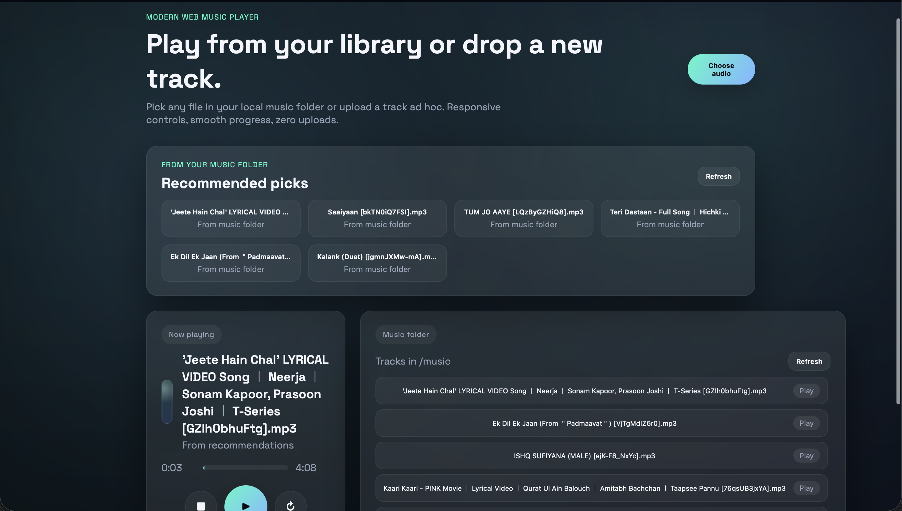

# 🎵 Pulse Player — Modern Web Music Player

A sleek, browser-based music player built with Flask and vanilla JavaScript. Play audio files from your local machine with a beautiful glassmorphic dark UI—no uploads, no external storage.



## ✨ Features

- **Zero Upload Architecture** — Audio files never leave your machine; local files use `URL.createObjectURL()`, library files stream directly
- **Glassmorphic Dark Theme** — Modern UI with blur effects, gradients, and smooth animations
- **Full Playback Controls** — Play, pause, resume, stop with clickable progress bar
- **Dual Audio Sources**:
  - Upload any audio file ad-hoc via "Choose audio" button
  - Stream from your `music/` folder library
- **Recommended Picks** — Random selection of 6 tracks from your library
- **Responsive Design** — Works on desktop and mobile browsers
- **Supported Formats** — MP3, WAV, OGG, M4A, FLAC

## 🚀 Quick Start

### Prerequisites

- Python 3.x installed on your system
- pip (Python package manager)

### Option 1: Using Virtual Environment (Recommended)

```bash
# Clone or navigate to the project
cd music-player

# Create virtual environment
python3 -m venv venv

# Activate virtual environment
# On macOS/Linux:
source venv/bin/activate
# On Windows:
venv\Scripts\activate

# Install dependencies
pip install flask

# Run the server
python music_player.py
```

### Option 2: Direct Installation

```bash
# Install Flask globally
pip3 install flask

# Run the server
python3 music_player.py
```

### Open in Browser

Navigate to **http://127.0.0.1:5000**

## 📁 Project Structure

```
music-player/
├── music_player.py      # Flask backend (API + file serving)
├── templates/
│   └── index.html       # Single-page HTML shell
├── static/
│   ├── app.js           # Client-side audio logic
│   └── style.css        # Glassmorphic dark theme
├── music/               # Drop your audio files here
└── README.md
```

## 🎧 How to Use

1. **Add Music to Library**  
   Drop audio files (`.mp3`, `.wav`, `.ogg`, `.m4a`, `.flac`) into the `music/` folder

2. **Play from Library**  
   Click any track in the "Music folder" panel or "Recommended picks" section

3. **Upload Ad-hoc Files**  
   Click "Choose audio" to play any audio file from your computer (file stays local)

4. **Playback Controls**  
   - ▶️ Play/Pause — Toggle playback
   - ⏹️ Stop — Stop and reset to beginning
   - 🔄 Resume — Continue from where you left off
   - Click anywhere on the progress bar to seek

## 🔌 API Endpoints

| Endpoint | Method | Description |
|----------|--------|-------------|
| `/` | GET | Serves the main HTML page |
| `/api/tracks` | GET | Returns JSON list of tracks in `music/` folder |
| `/music/<filename>` | GET | Streams audio file |

## 🛠️ Development

```bash
# Run in debug mode (auto-reload on changes)
python3 music_player.py

# The server runs with debug=True by default
```

## 📝 Notes

- **macOS Users**: Use `python3` and `pip3` instead of `python` and `pip`
- **Virtual Environment**: Always recommended to avoid dependency conflicts
- **Security**: The app includes path traversal protection for the `/music/` endpoint

## 📄 License

MIT License — feel free to use and modify!
